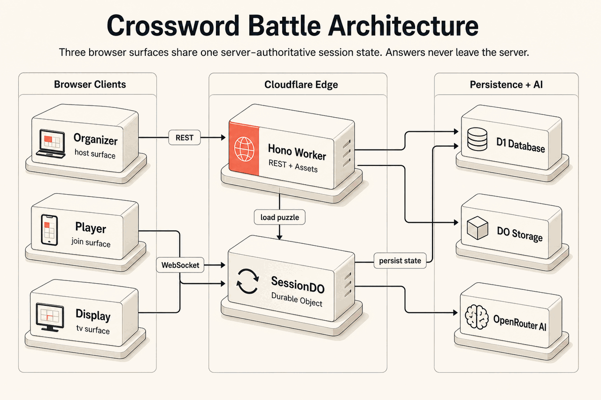
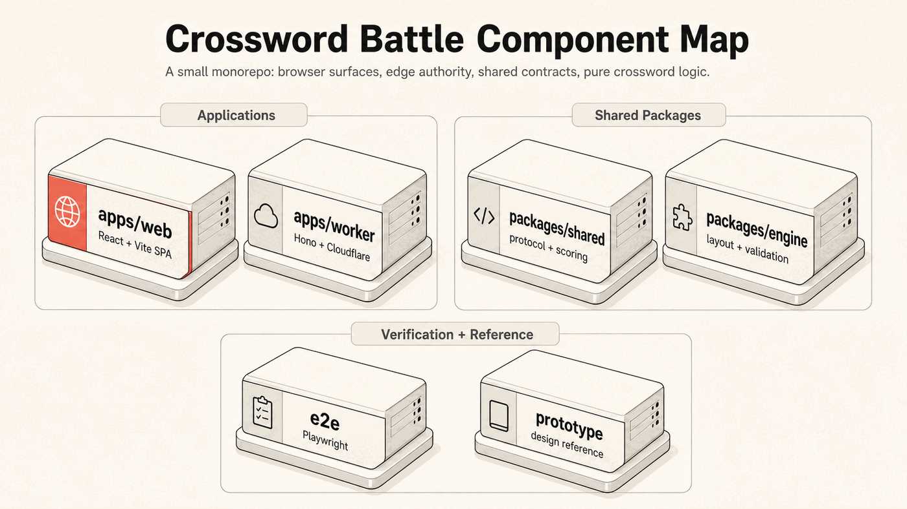
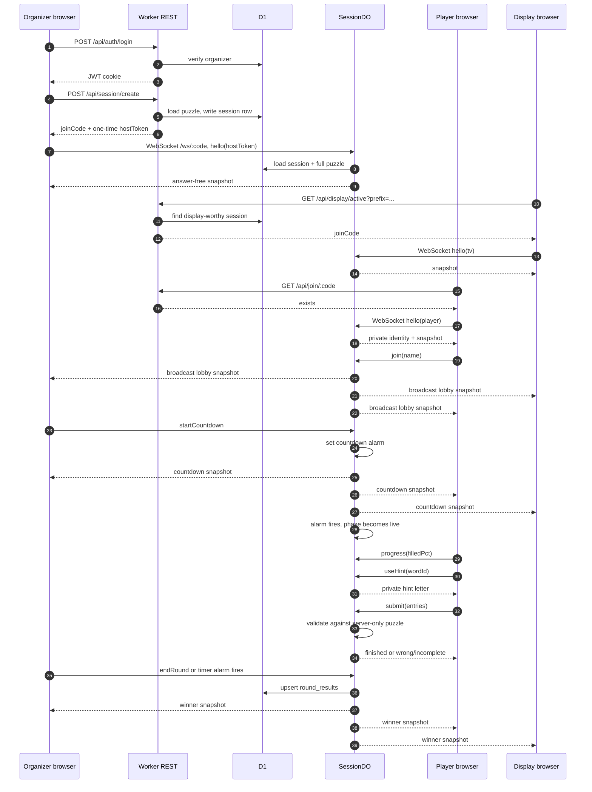

# Crossword Battle

Crossword Battle is a white-label, server-authoritative live crossword game for booths, classrooms, offsites, sales kickoffs, and other fast public play. An organizer opens a session, players join from their phones, and a public display turns the round into a small stage show: lobby, countdown, live board, winner reveal.



The product is built around one rule: **three surfaces, one truth**. Organizer, player, and display clients all derive from the same Durable Object state for a join code, while puzzle answers, finish timing, and ranking stay on the server.

## What It Does

- **Organizer** (`/host`) logs in, creates or resumes a session, builds or picks a puzzle, opens the lobby, starts countdown, monitors play, reveals the winner, and manages event branding.
- **Player** (`/j/:code`) joins with a name, waits in the lobby, solves the crossword, asks for limited AI hints, and sees their result.
- **Public display** (`/tv` or `/tv/:prefix`) shows booth standby, QR/join code, live countdown, leaderboard, and winner reveal on a 16:9 screen.

The design direction is documented in [PRODUCT.md](PRODUCT.md), [DESIGN.md](DESIGN.md), and [.impeccable/design.json](.impeccable/design.json). The short version: **The Editorial Stage** - press-cream paper, charcoal ink, mono system labels, hairlines, and a single Spotlight Coral accent reserved for the most important thing on the view.

## Architecture

Crossword Battle runs as a Cloudflare-native app:

- **`apps/web`** builds a React/Vite SPA for all browser surfaces.
- **`apps/worker`** serves the SPA, exposes REST routes, handles organizer auth, and routes WebSocket upgrades.
- **`SessionDO`** is one Durable Object per join code. It owns live phase, players, clock, pause state, hints, submissions, winner state, and snapshot fanout.
- **D1** stores organizers, puzzles, sessions, round history, leaderboard source data, and the editable event brand.
- **OpenRouter** powers AI word drafting and winner commentary, with curated fallbacks.



## Monorepo Layout

```text
apps/
  web/       React/Vite SPA for organizer, player, display, and landing routes
  worker/    Cloudflare Worker, Durable Object, D1 migrations, Worker tests
packages/
  engine/    Pure TypeScript crossword generation, puzzle building, validation
  shared/    Shared schemas, protocol messages, scoring, config, join code rules
e2e/         Playwright flows that drive real browser contexts through a full game
prototype/   Original high-fidelity prototype/reference, not production code
```

## Request Flow



## Runtime Guarantees

- **Server-authoritative correctness:** player clients receive only `PublicPuzzle`, which excludes answer letters. Submissions are checked inside `SessionDO` against the full puzzle rebuilt from D1.
- **Server-stamped timing:** finish time is calculated from the Durable Object clock, never trusted from a client payload.
- **Private rejoin:** players get a `playerId` plus a private `rejoinSecret`; the secret is required to reattach after reload.
- **Host authorization:** the host token is returned once on session creation or resume; only its SHA-256 hash is stored, and host WebSocket verbs require a constant-time match.
- **Bounded inputs:** shared zod schemas cap durations, penalties, max players, brand fields, and WebSocket message shapes.
- **White-label by construction:** `GET /api/config` returns the active `Brand`; the web app applies `--coral`, document title, and copy at runtime. `aiTone` is snapshotted into each session config when the round is created.

## Getting Started

Prerequisites:

- Node 24+
- pnpm 9.15.x, matching the pinned `packageManager`
- Playwright Chromium for e2e tests: `pnpm exec playwright install chromium`

Install dependencies:

```bash
pnpm install
```

Create `apps/worker/.dev.vars` for local Worker secrets:

```dotenv
OPENROUTER_API_KEY=...
AI_MODEL=google/gemini-3.1-flash-lite
JWT_SECRET=replace-with-a-long-random-secret
SEED_ORGANIZER_EMAIL=admin@example.com
SEED_ORGANIZER_PASSWORD=replace-with-a-local-password
```

Apply local D1 migrations:

```bash
pnpm --filter @cwb/worker exec wrangler d1 migrations apply crossword-battle --local
```

Build the web app and start the Worker:

```bash
pnpm --filter @cwb/web build
pnpm --filter @cwb/worker dev
```

Open the local app at `http://127.0.0.1:8787`:

- Organizer: `http://127.0.0.1:8787/host`
- Player: `http://127.0.0.1:8787/j/<JOIN-CODE>`
- Display prefix entry: `http://127.0.0.1:8787/tv`
- Display direct session: `http://127.0.0.1:8787/tv/<JOIN-CODE>`

Static assets come from `apps/web/dist`, so rebuild the web app before starting the Worker when frontend code changes.

## Scripts

```bash
pnpm -r typecheck
pnpm -r test
pnpm --filter @cwb/web build
pnpm --filter @cwb/worker dev
pnpm e2e
```

The root build runs the web build and the worker typecheck:

```bash
pnpm build
```

## Testing

- `packages/engine/test` verifies puzzle generation, puzzle construction, public projections, and validation.
- `packages/shared/test` verifies config, scoring, join codes, state, and WebSocket message contracts.
- `apps/worker/test` verifies auth, routes, D1 behavior, AI fallbacks, leaderboard/history, multi-booth routing, and `SessionDO`.
- `e2e` drives the complete browser experience with Playwright.

The Playwright suite starts its own clean local Worker stack through `e2e/start-server.mjs`: it builds the SPA, resets local Wrangler state, applies D1 migrations, starts `wrangler dev`, then runs isolated organizer, player, and display browser contexts.

## AI Features

AI is optional at runtime but wired through OpenRouter:

- `POST /api/ai/draft-words` drafts editable word/clue entries for the builder.
- `SessionDO` can generate winner commentary.
- Hint behavior stays server-controlled: the server reveals one correct letter for the requested word and enforces a per-player cooldown.

The AI path has curated fallbacks so the organizer flow still works when the provider is unavailable.

## Data Model

D1 stores long-lived product data:

- `organizers` - login accounts, booth prefixes, and join-code sequence counters.
- `puzzles` - preset and organizer-owned puzzle grids and clues. These include answer letters and are never sent directly to clients.
- `sessions` - join code, owner, puzzle, session config, status, and host-token hash.
- `round_results` - idempotent winner and leaderboard history per `(join_code, round)`.
- `event_brand` - singleton white-label brand row.

The Durable Object stores live, per-session state: phase, players, timers, pause state, prize state, commentary, alarm intent, and player hint/rejoin metadata. Full puzzle answers are kept in memory only after being rebuilt from D1.

## Deployment

Cloudflare bindings live in [apps/worker/wrangler.toml](apps/worker/wrangler.toml):

- Worker name: `crossword-battle`
- Static assets: `apps/web/dist`
- Durable Object binding: `SESSION`
- D1 binding: `DB`
- Public variable: `AI_MODEL`

Before deploying a new environment, provision or confirm the D1 database, apply migrations remotely, and set Worker secrets:

```bash
pnpm --filter @cwb/worker exec wrangler d1 migrations apply crossword-battle --remote
pnpm --filter @cwb/worker exec wrangler secret put OPENROUTER_API_KEY
pnpm --filter @cwb/worker exec wrangler secret put JWT_SECRET
pnpm --filter @cwb/worker exec wrangler secret put SEED_ORGANIZER_EMAIL
pnpm --filter @cwb/worker exec wrangler secret put SEED_ORGANIZER_PASSWORD
pnpm --filter @cwb/web build
pnpm --filter @cwb/worker exec wrangler deploy
```

## Design Guardrails

- Coral is a spotlight, not paint: use it once per view.
- Do not use pure black, SaaS blue, confetti, mascot-style gamification, or cold enterprise gray.
- Operational screens should stay quiet and confident; countdown, winner, and public display moments can be theatrical.
- Keep crossword interactions keyboard-playable and mobile-friendly.
- Keep public display text legible from across a room.

For UI or visual changes, read [PRODUCT.md](PRODUCT.md), [DESIGN.md](DESIGN.md), and [.impeccable/design.json](.impeccable/design.json) before touching code.
